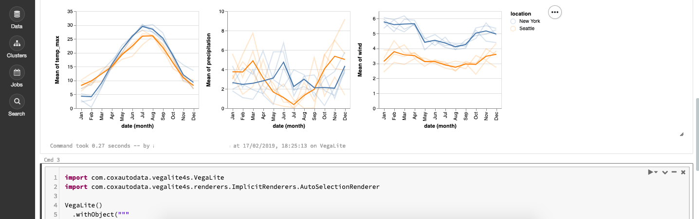
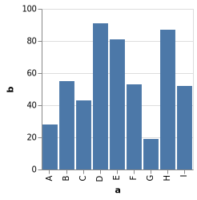

# Vega-Lite4s
[](https://travis-ci.org/CoxAutomotiveDataSolutions/vegalite4s) 
[](https://search.maven.org/search?q=g:com.coxautodata%20AND%20a:vegalite4s*) [](https://coveralls.io/github/CoxAutomotiveDataSolutions/vegalite4s?branch=master) 

## What is Vega-Lite4s?

Vega-Lite4s is a Scala library for creating simple visualisations from data. It is a small wrapper library over the comprehensive [Vega-Lite](https://vega.github.io/vega-lite/) Javascript visualisation library, allowing you to create beautiful Vega-Lite visualisations in Scala.

Vega-Lite4s is particularly useful when used in Notebook environments (e.g. Jupyter, Zeppelin etc.) to render visualisations within Notebooks, and also includes [support for Apache Spark](#how-do-i-use-vega-lite4s-with-apache-spark).




## Why would I use Vega-Lite4s?

Vega-Lite4s aims to make producing Vega-Lite visualisations in Scala as easy as possible. Vega-Lite4s takes an alternative approach to [Vegas](https://github.com/vegas-viz/Vegas) and [VL4S](https://github.com/rwpenney/vl4s) by not enforcing a typesafe DSL, and exposes the underlying Vega-Lite JSON spec. In this way, the approach is similar to that taken by [Oz](https://github.com/metasoarous/oz).

Vega-Lite4s has the following aims:

* Make rendering Vega-Lite visualisations in Scala in a variety of environments as frictionless as possible

* Not to enforce a typesafe DSL<sup>[1](#dsl)</sup>, allowing visualisations to be created by several methods including raw JSON strings

* Ensure Vega-Lite4s is not tied to a particular Vega-Lite version, allowing past and future versions of Vega-Lite to be used without changes to the Vega-Lite4s library

* Allow the Vega-Lite Javascript libraries to be provided in a generic way, including linking to the Vega-Lite libraries (default approach) or embedding them from a local resource (to allow Vega-Lite4s to work in environments with no direct internet access)

<sup name="dsl">1</sup>Whilst typesafety is very effective for ensuring correctness of code, Vega-Lite4s will most likely be used in Notebook environments where the exploratory nature of working will limit the necessity for typesafety. Also, a DSL would likely couple Vega-Lite4s to a particular Vega-Lite spec preventing the underlying Vega-Lite version to be changed. We would happily welcome a DSL, however it should compliment the existing approach and aim to be Vega-Lite spec generic if possible.

## How do I get started?

Include the following JAR as a dependency in your SBT project:
```scala
libraryDependencies += "com.coxautodata" %% "vegalite4s" % vegalite4sversion
```

or Maven project:

```xml
<dependency>
    <groupId>com.coxautodata</groupId>
    <artifactId>vegalite4s_${scala.compatible.version}</artifactId>
    <version>${vegalite4s.version}</version>
</dependency>
```

To create a simple plot in a Notebook environment (taken from [here](https://vega.github.io/vega-lite/examples/bar.html)):

```scala
import com.coxautodata.vegalite4s.VegaLite
import com.coxautodata.vegalite4s.renderers.ImplicitRenderers.AutoSelectionRenderer

VegaLite()
  .withObject("""
  {
  "$schema": "https://vega.github.io/schema/vega-lite/v3.json",
  "description": "A simple bar chart with embedded data.",
  "data": {
    "values": [
      {"a": "A","b": 28}, {"a": "B","b": 55}, {"a": "C","b": 43},
      {"a": "D","b": 91}, {"a": "E","b": 81}, {"a": "F","b": 53},
      {"a": "G","b": 19}, {"a": "H","b": 87}, {"a": "I","b": 52}
    ]
  },
  "mark": "bar",
  "encoding": {
    "x": {"field": "a", "type": "ordinal"},
    "y": {"field": "b", "type": "quantitative"}
  }
  }""")
  .show
```

This would produce the following visualisation:



To create the plot, the `withObject` function was used to add fields to the Vega-Lite schema object by parsing a raw JSON string. You can use additional functions described in [Plot Functions](#plot-functions) to add JSON to the schema in other way, and you can use the functions in [Plot Helpers](#plot-helpers) and [Spark Plot Helpers](#spark-plot-helpers) to add fields to the spec without using raw JSON (e.g adding collections to the data field).

As seen in the example, to render a plot the `show` function is called. The `show` function is defined in the following way:

```scala
def show(implicit r: PlotRenderer)
```

An implicit `PlotRenderer` is passed to `show` to provide the implementation of how the plot is renderer. In the example, the `AutoSelectionRenderer` plot renderer was imported to provide an implementation that attempts to auto-select the correct rendering approach depending on which environment is currently being used. See the [Plot Renderers](#plot-renderers) section for a list of the available rendering options.

In the above example the specific version of Vega-Lite to use was not given. By default, Vega-Lite4s will use the latest available released version of Vega-Lite (currently 2.x). A different version of Vega-Lite can be given when creating the `VegaLite` object:

```scala
object VegaLite {
  def apply(provider: VegaLiteProvider = LatestCDNVersion): VegaLite
}
```

The `VegaLiteProvider` object is responsible for providing the underlying Vega-Lite Javascript dependency. See the [Providers](#providers) and [Spark Providers](#spark-providers) sections for the available provider options.

It is important to note that Vega-Lite4s is only a wrapper around the Vega-Lite spec and you should consult the very instructive [Vega-Lite documentation](https://vega.github.io/vega-lite/) on how to construct Vega-Lite visualisations.

### Plot Functions
Simply put, Vega-Lite4s really consists of a way to create and manipulate a VegaLite JSON spec and a way to render the spec into a visualisation. There are several functions to help with building up your VegaLite spec.

#### withObject

There are two `withObject` functions that are used to add a whole JSON object to the top-level spec.

The first takes a JSON object as a string and parses it before adding it to the spec:
```scala
def withObject(json: String): VegaLite
```

The second takes a [Circe](https://circe.github.io/circe/) `JsonObject` and adds that to the spec:
```scala
def withObject(o: JsonObject): VegaLite
```

Note: existing fields will be overwritten if the same field is provided in the provided JSON object.

For example:
```scala
VegaLite()
    .withObject("""{ "a": "a" }""")
    .withObject(JsonObject("a" -> Json.fromString("aa")))
```

would produce the spec:
```json
{
  "a" : "aa"
}
```

#### withField

There are also two `withField` functions that are used for adding individual fields to a spec. In both cases adding a field to a spec that already contains that field will overwrite the existing value.


The first function takes JSON as a string and parses that into a valid JSON object or array<sup>[2](#jstring)</sup>:
```scala
def withField(field: String, value: String): VegaLite
```

The second function takes a Circe `Json` object and adds that as the field in the spec object:
```scala
def withField(field: String, value: => Json): VegaLite
```

<sup name="jstring">1</sup>Only valid JSON structures can be parsed from strings, therefore JSON value types cannot be added using a string. Doing so will result in an exception such as: `io.circe.ParsingFailure: exhausted input`. To add a simple type such as a string to the field value you can do the following:
```scala
import io.circe.Json
plot.addField("k", Json.fromString("v"))
```

### Plot Helpers

There is a small set of helper functions that can be added to a plot object with the following import:
```scala
import com.coxautodata.vegalite4s.PlotHelpers._
``` 

#### withTitle

The `withTitle` will simply add a title field to the Vega-Lite spec:

```scala
plot.withTitle("Plot Title")
```

#### withWidth and withHeight

The `withWidth` and `withHeight` will add a width and height field to the Vega-Lite spec:

```scala
plot
  .withWidth(400)
  .withHeight(600)
```

#### withData

The `withData` function adds any data collection into the `data` field of the Vega-Lite spec as an [inline dataset](https://vega.github.io/vega-lite/docs/data.html#inline).

The function is defined as:
```scala
def withData(values: => Seq[Map[String, Any]]): VegaLite
```

It takes a `Seq` of `Map` objects, that map from keys to `Any` values. Vega-Lite4s will attempt to convert the value of the `Any` to the appropriate JSON representation. If the value cannot be mapped to a JSON representation then the value of `toString` is used.

### Plot Renderers
Plot renderer objects tell Vega-Lite4s how to render the plot when `show` is called. There are several pre-defined renders that cover most cases:

* [`AutoSelectionRenderer`](#autoselectionrenderer): Useful in Notebook environments where the correct rendering approach is auto-detected
* `WindowRenderer`: The visualisation is rendered in a JavaFX window
* `HTMLPagePrintlnRenderer`: A full-page HTML document is printed to the console
* [`HTMLRenderer`](#htmlrenderer): A generic HTML rendering case class that can be used to easily create a renderer that uses a custom approach

#### AutoSelectionRenderer
The AutoSelectionRenderer attempts to detect the correct rendering approach to use in a Notebook environment. Underneath it uses Scala macros to detect the current environment. It currently detects the following environments in order:
 1. [Databricks Notebook](https://docs.databricks.com/user-guide/notebooks/index.html)
 2. [Toree interpreter](https://toree.apache.org/)
 3. [Almond interpreter](https://github.com/almond-sh/almond)
 4. [Zeppelin Spark interpreter](https://zeppelin.apache.org/docs/latest/interpreter/spark.html)
 5. [Livy interpreter](https://zeppelin.apache.org/docs/0.8.0/interpreter/livy.html)
 6. `HTMLPagePrintlnRenderer` as fallback
 
The AutoSelectionRenderer can be imported in to the plot environment with:
```scala
import com.coxautodata.vegalite4s.renderers.ImplicitRenderers.AutoSelectionRenderer
```

#### HTMLRenderer
The HTMLRenderer can be used to quickly implement a custom rendering function. It is defined in the following way:
```scala
case class HTMLRenderer(render: String => Unit, fullHTMLPage: Boolean)
    extends PlotRenderer
``` 
It takes a rendering function that takes a HTML input as string, and a boolean value signifying whether the HTML output should be a full-page document including `<head>` and `<body>` tags or an embeddable HTML document including only `<div>` and `<script>` tags.

For example, to implement a custom renderer for Zeppelin you would do the following:
```scala
import com.coxautodata.vegalite4s.renderers.HTMLRenderer
implicit val renderer = HTMLRenderer(h => s"%html\n$h", false)
```

### Providers
Providers dictate how the underlying Vega-Lite library dependency is resolved and which version of Vega-Lite to use. A provider can be optionally passed to the Vega-Lite constructor when a plot is created:
```scala
object VegaLite {
  def apply(provider: VegaLiteProvider = LatestCDNVersion): VegaLite
}
```

By default, the object `LatestCDNVersion` is used which is a specific instance of the [`JsdelivrProvider`](#jsdelivrprovider) pointing to the latest release of Vega-Lite:

```scala
object LatestCDNVersion extends JsdelivrProvider("3", "2", "3")

```

#### JsdelivrProvider
The JsdelivrProvider provider references to the Vega-Lite library resource on the jsDelivr CDN. The reference is either included in the `src` field of a `<script>` tag if a full-page HTML document is rendered or dynamically loaded in the document if an embeddable plot is rendered.

It is defined in the following way:
```scala
case class JsdelivrProvider(vegaVersion: String,
                            vegaLiteVersion: String,
                            vegaEmbedVersion: String)
    extends VegaLiteProvider
```

You can use any valid [jsDeliver versioning](https://vega.github.io/vega-lite/usage/embed.html#cdn) to reference the resources. For example, to use the latest release candidate of Vega-Lite 3 you would do the following:

```scala
import com.coxautodata.vegalite4s.providers.JsdelivrProvider
val provider = JsdelivrProvider("4.4.0", "3.0.0-rc12", "3.29.1")
```

#### InputStreamProvider
The `InputStreamProvider` class provides the Vega libraries for rendering plots by reading the Javascript sources as InputStreams and creating a Base64 `src` string so they can be included in a HTML document directly without referencing an external Javascript library. 

Using this class or one of the providers using this class (i.e. [ClasspathJarResourceProvider](#classpathjarresourceprovider) or [LocalFileProvider](#localfileprovider)) allows VegaLite plots to be rendered in an environment without direct access to CDNs or the internet.

#### ClasspathJarResourceProvider
A VegaLite provider that find the Vega, Vega-Lite and Vega-Embed Javascript libraries by searching in the Jar dependencies on the classpath and embeds them in the rendered plot using the [InputStreamProvider](#inputstreamprovider).

This allows all plot Javascript dependencies to be provided by JAR artifacts, i.e. by setting the following as a project dependency:
```scala
"org.webjars.npm" % "vega" % "3.3.1" % intransitive ()
"org.webjars.npm" % "vega-lite" % "2.6.0" % intransitive ()
"org.webjars.npm" % "vega-embed" % "3.29.1" % intransitive ()
```

#### LocalFileProvider
A VegaLite dependency provider that takes the paths to the Javascript files on the local system and embeds them in the rendered plot using the [InputStreamProvider](#inputstreamprovider).

It is defined in the following way:
```scala
object LocalFileProvider {
  def apply(vegaLiteSchemaVersion: String,
            vegaPath: String,
            vegaLitePath: String,
            vegaEmbedPath: String): VegaLiteProvider
}
```

## How do I use Vega-Lite4s with Apache Spark?
Vega-Lite4s has support for Apache Spark, and allows for `Dataset` objects to be added to the data field in the Vega-Lite spec.

To enable Apache Spark support, include the following JAR as a dependency in your SBT project:
```scala
libraryDependencies += "com.coxautodata" %% "vegalite4s-spark2" % vegalite4sversion
```

or Maven project:

```xml
<dependency>
    <groupId>com.coxautodata</groupId>
    <artifactId>vegalite4s-spark2_${scala.compatible.version}</artifactId>
    <version>${vegalite4s.version}</version>
</dependency>
```

### Spark Plot Helpers
Apache Spark helper functions can be added to VegaLite plots with the following import:
```scala
import com.coxautodata.vegalite4s.spark.PlotHelpers._
```

#### withData using Datasets
Spark Dataset objects can be added as data inputs to plots using the `withData` function:
```scala
def withData(ds: Dataset[_], limit: Int = 10000): VegaLite
```

The data is added to the spec in the same way as the earlier [`withData`](#withdata) function by adding the data inline. The Dataset column names are used as VegaLite column names in the Map. Spark DAG execution will not be triggered until the plot is rendered, and the Dataset will be sampled if the record size is over the provided record limit.

### Spark Providers

#### HadoopFSFileProvider
A VegaLite dependency provider that takes the paths to the Javascript files on a Hadoop Filesystem and embeds them in the rendered plot using the [InputStreamProvider](#inputstreamprovider).

## How can I contribute to Vega-Lite4s?

We welcome all users to contribute to the development of Vega-Lite4s by raising pull-requests. We kindly ask that you include suitable unit tests along with proposed changes.

## What is Vega-Lite4s licensed under?

Licensed under the Apache License, Version 2.0 (the "License");
you may not use this file except in compliance with the License.
You may obtain a copy of the License at

    http://www.apache.org/licenses/LICENSE-2.0

Unless required by applicable law or agreed to in writing, software
distributed under the License is distributed on an "AS IS" BASIS,
WITHOUT WARRANTIES OR CONDITIONS OF ANY KIND, either express or implied.
See the License for the specific language governing permissions and
limitations under the License.

Copyright 2019 Cox Automotive UK Limited